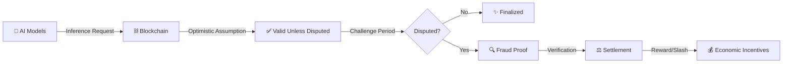
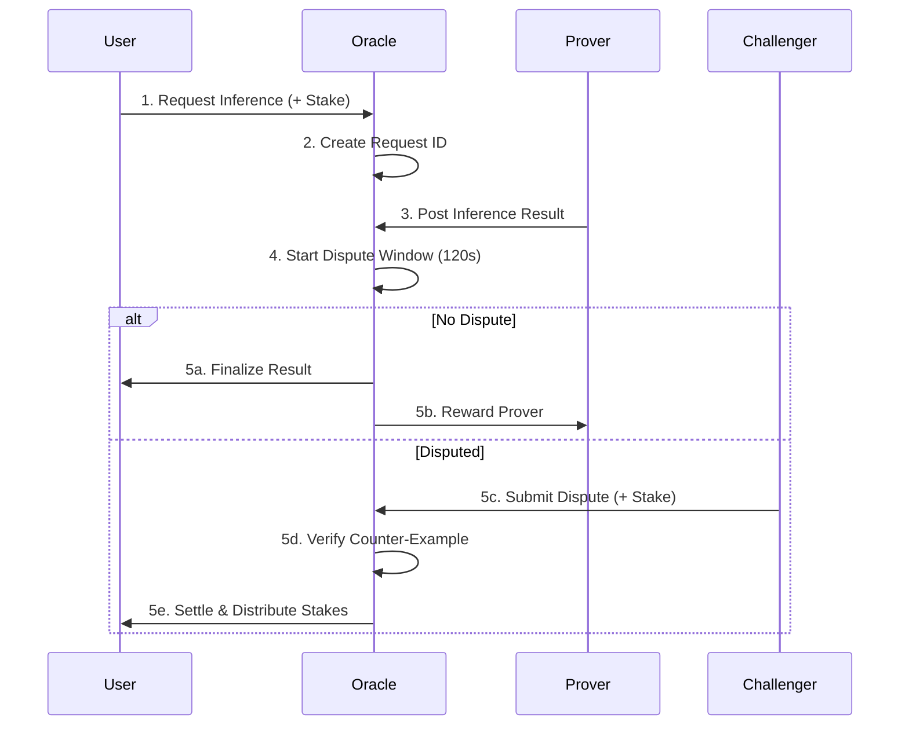
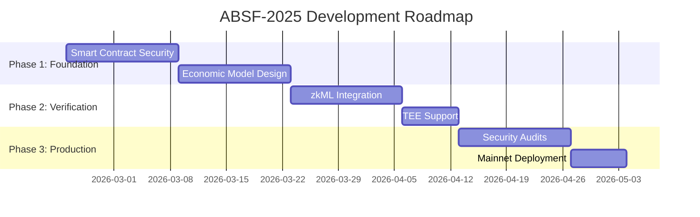

<div align="center">

# 🌌 ABSF-2025
### AI-Blockchain Symbiosis Framework


**Decentralized AI Inference with Optimistic Verification**

[🚀 Quick Start](#-quick-start) • [📖 Documentation](#-architecture) • [🔬 Research](#-research-foundation) • [🤝 Contributing](#-contributing)

---

</div>

## 🎯 Vision

ABSF (AI-Blockchain Symbiosis Framework) bridges the gap between artificial intelligence and blockchain technology, creating a **trust-minimized, privacy-preserving, and economically incentivized** ecosystem for AI inference verification.

### 🌟 What Makes ABSF Unique?



<div align="center">

### 🎨 Core Principles

| 🔐 **Trust-Minimized** | ⚡ **Scalable** | 🛡️ **Secure** | 💎 **Economically Sound** |
|:---:|:---:|:---:|:---:|
| Optimistic verification reduces on-chain overhead | Off-chain computation with on-chain finality | Stake-based dispute resolution | Game theory ensures honest behavior |

</div>

---

## 🏗️ Architecture

### 📦 System Components

```
absf-2025/
├── 🔷 contracts/              # Smart Contracts
│   └── OptimisticOracle.sol   # Core oracle implementation
├── 🎨 absf-frontend/          # React Web3 dApp
│   └── src/
│       ├── App.js             # Main application
│       └── App.css            # Styling
├── 🛠️ scripts/                # Deployment & Interaction
│   ├── deploy.js              # Contract deployment
│   ├── interact.js            # Contract interaction
│   ├── requestInference.js    # Inference request example
│   └── run_opml_tests.py      # Python testing suite
└── 📄 Configuration Files
    ├── hardhat.config.js      # Hardhat configuration
    ├── package.json           # Node dependencies
    └── requirements.txt       # Python dependencies
```

### 🔄 Workflow

<div align="center">



</div>

---

## 🚀 Quick Start

### 📋 Prerequisites

<table>
<tr>
<td>

**Required**
- Node.js ≥ 16.0
- npm or yarn
- MetaMask wallet
- Sepolia testnet ETH

</td>
<td>

**Recommended**
- VS Code with Solidity extension
- Hardhat extension
- Git for version control

</td>
</tr>
</table>

### ⚙️ Installation

```bash
# 1️⃣ Clone the repository
git clone https://github.com/IamTamheedNazir/absf-2025.git
cd absf-2025

# 2️⃣ Install dependencies
npm install

# 3️⃣ Configure environment
cp .env.example .env
# Edit .env with your credentials:
# PRIVATE_KEY=your_private_key_without_0x
# INFURA_API_KEY=your_infura_project_id
# ETHERSCAN_API_KEY=your_etherscan_api_key
```

### 🔨 Compile & Deploy

```bash
# Compile smart contracts
npx hardhat compile

# Deploy to Sepolia testnet
npx hardhat run scripts/deploy.js --network sepolia

# Verify on Etherscan (optional)
npx hardhat verify --network sepolia DEPLOYED_CONTRACT_ADDRESS
```

### 🎮 Run Frontend

```bash
cd absf-frontend
npm install
npm start
# Open http://localhost:3000
```

---

## 💡 Smart Contract Interface

### 🔑 Core Functions

<details>
<summary><b>📤 requestInference</b> - Submit an AI inference request</summary>

```solidity
function requestInference(
    bytes32 modelHash,    // Hash of the AI model
    bytes memory inputData // Input data for inference
) external payable returns (uint256 requestId)
```

**Requirements:**
- `msg.value >= MIN_STAKE` (0.1 ETH)
- Valid model hash and input data

**Returns:** Unique request ID for tracking

</details>

<details>
<summary><b>📥 postInference</b> - Submit inference result (Prover)</summary>

```solidity
function postInference(
    uint256 requestId,      // Request to respond to
    bytes memory outputData // Inference result
) external
```

**Requirements:**
- Within dispute window
- Output not already posted
- Caller is not the requester

</details>

<details>
<summary><b>⚔️ disputeInference</b> - Challenge an inference result</summary>

```solidity
function disputeInference(
    uint256 requestId,           // Request to dispute
    bytes memory counterExample  // Proof of incorrect inference
) external payable
```

**Requirements:**
- `msg.value >= request.stake`
- Within dispute window
- Not already disputed

</details>

### 📊 State Variables

| Variable | Type | Description |
|----------|------|-------------|
| `DISPUTE_WINDOW` | `uint256` | Challenge period (120 seconds) |
| `MIN_STAKE` | `uint256` | Minimum stake required (0.1 ETH) |
| `requestId` | `uint256` | Counter for request IDs |
| `requests` | `mapping` | Request ID → InferenceRequest struct |

---

## 🔬 Research Foundation

ABSF-2025 is built on cutting-edge research in decentralized AI and blockchain verification:

### 📚 Key Concepts

<table>
<tr>
<td width="50%">

**🎲 Optimistic Verification**
- Assume validity unless challenged
- Reduces on-chain computation
- Economic incentives ensure honesty
- Inspired by Optimistic Rollups (Arbitrum, Optimism)

</td>
<td width="50%">

**🔐 Fraud Proofs**
- Cryptographic proof of incorrect computation
- Submitted during dispute window
- Verified on-chain efficiently
- Slashing mechanism for malicious actors

</td>
</tr>
<tr>
<td>

**🎯 Game Theory**
- Schelling point coordination
- Stake-based incentive alignment
- One honest node suffices
- Nash equilibrium for truthfulness

</td>
<td>

**🌐 Decentralized AI**
- No single point of failure
- Censorship-resistant inference
- Privacy-preserving computation
- Scalable verification

</td>
</tr>
</table>

### 🎓 Academic Acknowledgments

> **Special thanks to Professor Dr. Bhavya Alankar**  
> Department of Computer Science Engineering  
> Jamia Hamdard University  
> 
> For invaluable mentorship and guidance throughout this research project.

---

## 🌍 Use Cases

<div align="center">

### 🏥 Healthcare
**Federated Learning**
```
Train models across hospitals
while preserving data locality
using on-chain provenance
```

### 💰 DeFi
**Anomaly Detection**
```
Detect flash loan attacks
and suspicious behaviors
using AI + blockchain
```

### 🌐 Social Media
**Misinformation Detection**
```
Verify AI-detected misinformation
while maintaining privacy
with zk-SNARKs
```

### 🌱 Sustainability
**Carbon-Aware Consensus**
```
Adjust block production
based on validator energy usage
with Energy Web APIs
```

</div>

---

## 🛣️ Roadmap



### ✅ Current Status: Academic Prototype
### 🎯 Target: Production-Ready System

**Milestones:**
- [x] Core optimistic oracle implementation
- [x] Basic frontend interface
- [x] Sepolia testnet deployment
- [ ] Security audit (OpenZeppelin/Trail of Bits)
- [ ] Comprehensive test suite (80%+ coverage)
- [ ] zkML verification layer
- [ ] TEE integration
- [ ] Mainnet launch

---

## 🧪 Testing

### 🔬 Run Tests

```bash
# Hardhat tests
npx hardhat test

# Coverage report
npx hardhat coverage

# Gas report
REPORT_GAS=true npx hardhat test

# Python tests
python scripts/run_opml_tests.py
```

### 📊 Current Coverage

| Component | Coverage | Status |
|-----------|----------|--------|
| Smart Contracts | 0% | 🔴 In Progress |
| Frontend | 0% | 🔴 In Progress |
| Integration | 0% | 🔴 In Progress |

**Target:** 80%+ coverage before mainnet

---

## 🔐 Security

### ⚠️ Known Issues (Academic Prototype)

<details>
<summary><b>🔴 CRITICAL: Reentrancy Vulnerability</b></summary>

**Location:** `settleInference()` function  
**Risk:** High - Potential fund drainage  
**Status:** 🔧 Fix in progress  
**Solution:** Implement OpenZeppelin ReentrancyGuard

</details>

<details>
<summary><b>🟠 HIGH: Broken Verification Logic</b></summary>

**Location:** `verifyCounterExample()` function  
**Risk:** Critical - Dispute mechanism ineffective  
**Status:** 🔧 Fix in progress  
**Solution:** Implement proper fraud proof verification

</details>

<details>
<summary><b>🟡 MEDIUM: Short Dispute Window</b></summary>

**Current:** 120 seconds  
**Recommended:** 24-48 hours  
**Status:** 📋 Planned  
**Rationale:** Allow sufficient time for verification

</details>

### 🛡️ Security Roadmap

- [ ] OpenZeppelin ReentrancyGuard integration
- [ ] Proper fraud proof implementation
- [ ] Access control mechanisms
- [ ] Emergency pause functionality
- [ ] Slither static analysis
- [ ] Mythril symbolic execution
- [ ] Professional security audit
- [ ] Bug bounty program

---

## 🤝 Contributing

We welcome contributions from the community! Here's how you can help:

### 🌟 Ways to Contribute

<table>
<tr>
<td align="center">

**🐛 Report Bugs**

Found an issue?  
[Open an issue](../../issues)

</td>
<td align="center">

**💡 Suggest Features**

Have an idea?  
[Start a discussion](../../discussions)

</td>
<td align="center">

**🔧 Submit PRs**

Want to code?  
[Fork & PR](../../pulls)

</td>
<td align="center">

**📖 Improve Docs**

Help others learn  
[Edit docs](../../wiki)

</td>
</tr>
</table>

### 📝 Contribution Guidelines

1. **Fork** the repository
2. **Create** a feature branch (`git checkout -b feature/AmazingFeature`)
3. **Commit** your changes (`git commit -m 'Add AmazingFeature'`)
4. **Push** to the branch (`git push origin feature/AmazingFeature`)
5. **Open** a Pull Request

### 🎨 Code Style

- Follow [Solidity Style Guide](https://docs.soliditylang.org/en/latest/style-guide.html)
- Use meaningful variable names
- Add comprehensive comments
- Write tests for new features
- Ensure all tests pass before PR

---

## 📜 License

This project is licensed under the **MIT License** - see the [LICENSE](LICENSE) file for details.

```
MIT License

Copyright (c) 2025 Tamheed Nazir

Permission is hereby granted, free of charge, to any person obtaining a copy
of this software and associated documentation files (the "Software"), to deal
in the Software without restriction, including without limitation the rights
to use, copy, modify, merge, publish, distribute, sublicense, and/or sell
copies of the Software, and to permit persons to whom the Software is
furnished to do so, subject to the following conditions:

The above copyright notice and this permission notice shall be included in all
copies or substantial portions of the Software.
```

---

## 🔗 Resources

<div align="center">

### 📚 Documentation & Learning

[](https://docs.uma.xyz/)
[](https://docs.openzeppelin.com/)
[](https://hardhat.org/)
[](https://ethereum.org/developers)

### 🛠️ Tools & Frameworks

[](https://docs.soliditylang.org/)
[](https://react.dev/)
[](https://docs.ipfs.tech/)
[](https://docs.chain.link/)

</div>

---

## 👨‍💻 Author

<div align="center">

**Tamheed Nazir**

[](https://github.com/IamTamheedNazir)
[](https://linkedin.com/in/tamheednazir)
[](https://twitter.com/tamheednazir)
[](mailto:tamheed@example.com)

</div>

---

## 🌟 Star History

<div align="center">

[](https://star-history.com/#IamTamheedNazir/absf-2025&Date)

**If you find this project useful, please consider giving it a ⭐!**

</div>

---

## 📊 Project Stats

<div align="center">


</div>

---

<div align="center">

### 💬 Questions or Feedback?

**We'd love to hear from you!**

[Open an Issue](../../issues) • [Start a Discussion](../../discussions) • [Join our Discord](#)

---

**Built with ❤️ for the decentralized AI future**

*Empowering trust-minimized AI inference on the blockchain*

</div>

---

<div align="center">

### 🙏 Acknowledgments

Special thanks to:
- **UMA Protocol** for optimistic oracle inspiration
- **OpenZeppelin** for secure smart contract libraries
- **Ethereum Foundation** for the robust blockchain platform
- **Hardhat Team** for excellent development tools
- **The Web3 Community** for continuous innovation

</div>

---

<div align="center">

**[⬆ Back to Top](#-absf-2025)**

</div>
